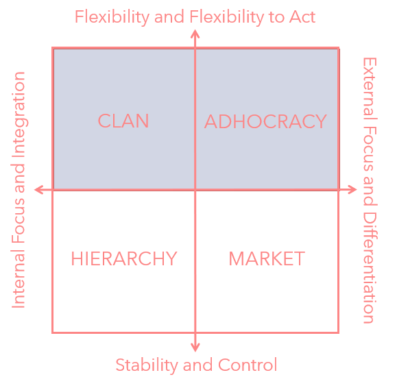
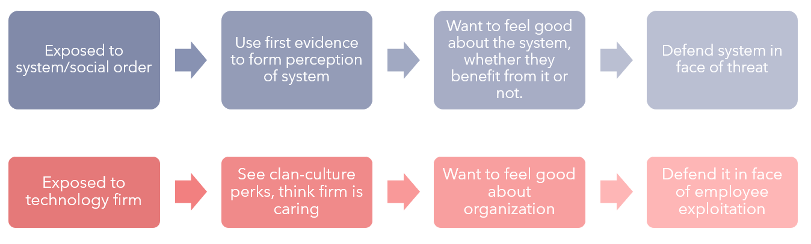
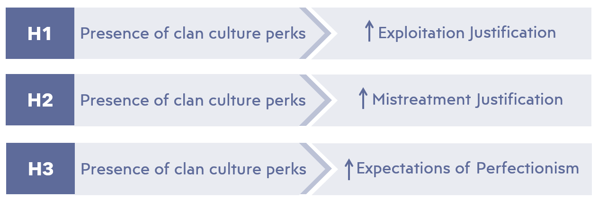
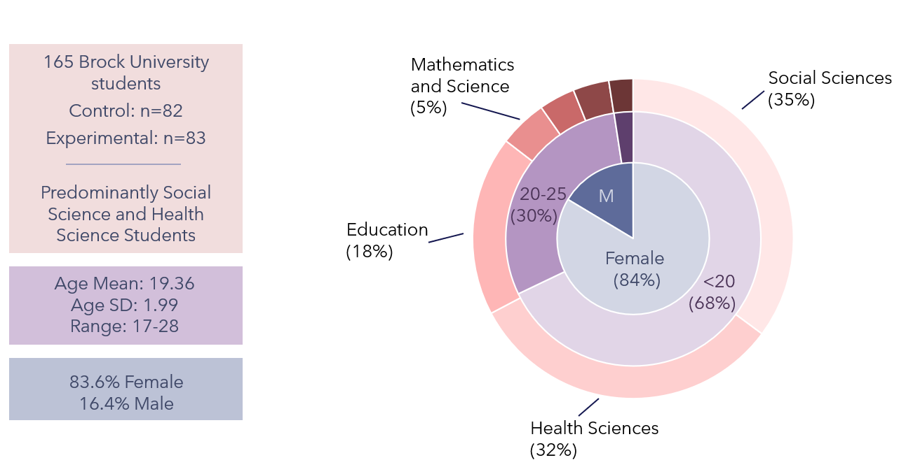
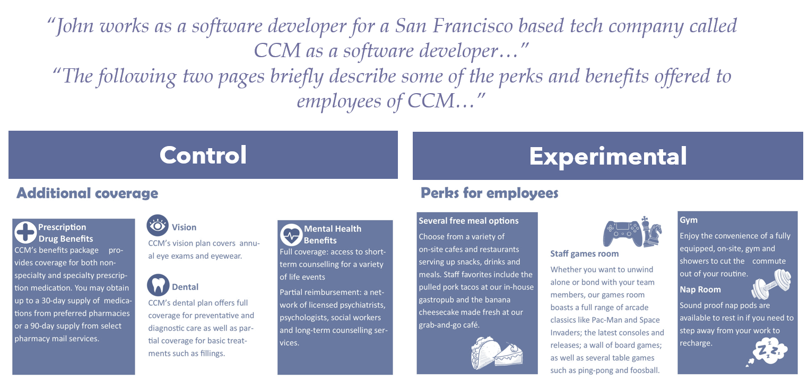
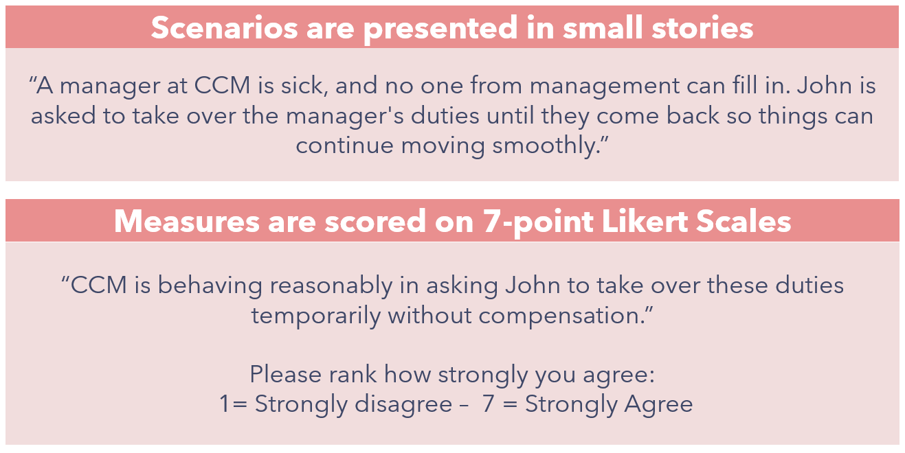
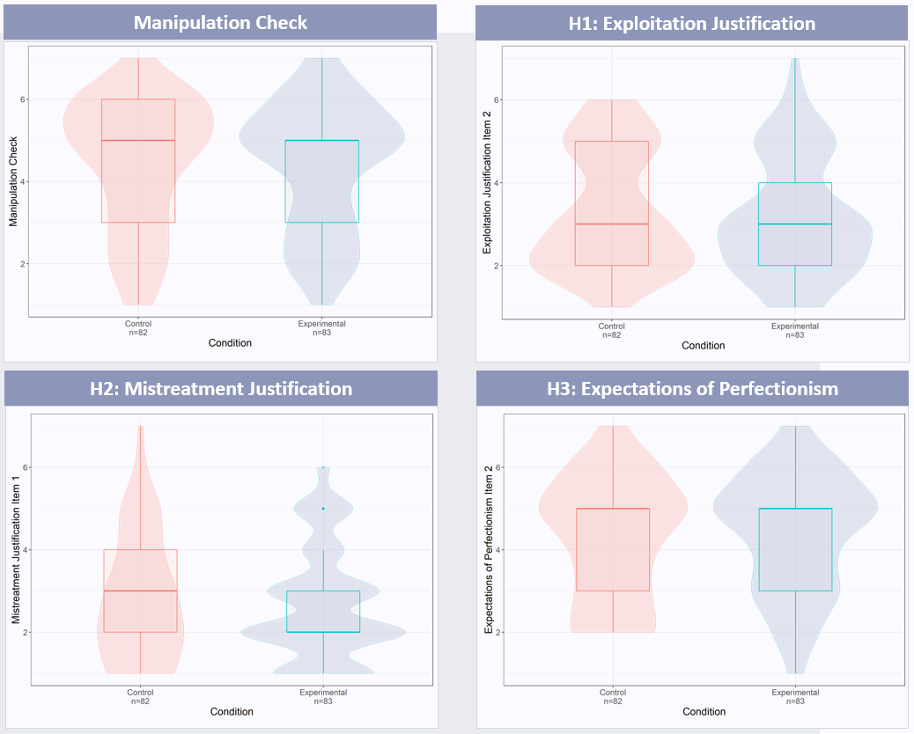
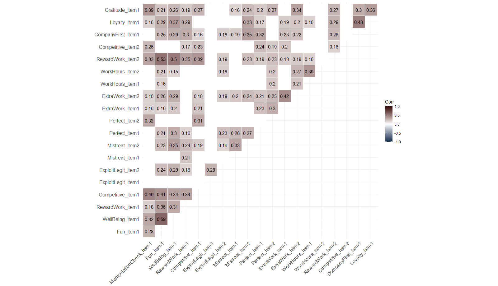

# Psychology, Research Stream, Undergraduate Thesis

## Overview

### Conference Poster 

 
 
   
### Focus of Study

The focus of this study was understanding how cues of a company's culture (ie., the shared beliefs, values and assumptions), impact the way outsiders perceive employee treatment within. Namely, we wanted to see if observers were more likely to justify mistreatment and exploitation within an organization if they had previously encountered information that labeled the company as one that treated it’s employees like family members, was a fun place to be. 

### Theoretical Foundations 

#### Competing Values Framework 
The focus of this study was understanding how cues of a company's culture (i.e., the shared beliefs, values and assumptions) impact the way outsiders perceive employee treatment within. Namely, we wanted to see if observers were more likely to justify mistreatment and exploitation within an organization if they had previously encountered information that labelled the company as one that treated its employees like family members, was a fun place to be. 

#### System Justification Theory
System justification theory suggests that if a company were to present a signal that they prioritize employee well being early on, the observer would use that information to form their perception of the company and remain motivated to protect that image in the face of contradicting information such as instances of employee mistreatment in the name of productivity.

### Hypotheses

We hypothesized that if a participant received culture signals that implied a prioritization on internal focus (in this case, clan culture perks were used as signals) when being introduced to a fictitious company, they would be more likely to justify instances of exploitation, mistreatment and unfair expectations observed towards employees of the company to protect their positive image.

To quickly define these terms:
 - A clan culture perk is a perk offered by a company that is geared towards novelty or fun  (e.g., staff gym or games room) as opposed to typically functional benefits (e.g., healthcare benefits). These signal to outsiders that the company has a clan culture which is a culture defined in the Competing Values Framework as one which prioritizes flexibility and the well-being of its employees above the market/competitors or stability.
 - Exploitation is the expectation or requirement that staff carry out tasks that are unfairly compensated and/or beyond job scope as defined during the hiring process.
 -  Mistreatment is defined as unfair or demeaning treatment from superiors. 
 -  Expectations of perfectionism are when a superior holds unreasonably high work standards for their employees and responds with unjustified anger or punishments to accidental errors or imperfect work.

### Procedure

This study was carried out on a sample of 165 University students (Mage= 19.36, SDage = 1.99) which were notably, predominantly young, female (82.6%) and studying Social Sciences (35%) and Health Sciences (32%).

To study this, we chose to use an industry that has remained at the forefront of workplace modernization, which is the tech sector. We introduced participants to a fake tech company and an employee named John, who works there as a software engineer (a pilot study previously showed no difference in perception when a male or female employee was used). We then showed participants brochures containing information on the benefits available to employees at the company CCM. Those in the control condition were shown typical perks such as dental and vision coverage, while those in the control condition were shown how CCM provided its employees with free on-site pubs, a games room, a gym and a nap room for its employees. 

Then all participants read through stories including instances of mistreatment and exploitation as CCM and were asked to rate how strongly they felt the treatment of employees was justified.

### Results
#### Analysis of Means between Key Outcome Variables
Initially, analysis of the means for all key outcome variables between the control and experimental condition showed no significant difference between conditions in:
- Justification of exploitation (t(163) = 0.93, p = 0.35)
- Justification of mistreatment (t(163) = 0.7, p = 0.49) 
- Expectations of perfectionism (t(163) = -0.57, p = 0.57) 

To better these findings, the difference in means of the IV manipulation was performed. No significant difference in perception of perks between conditions (t(163) = 0.27, p = 0.79).

#### Correlational Analysis between Measures of Percieved Culture and Employee Treatment

After the analysis of means revealed that our manipulation between conditions was ineffective, correlational analysis was performed to investigate relationships between an individual's perception of CCM's workplace culture and their attitudes towards employee treatment regardless of condition. This showed that the perception of CCM as a fun place to work and as one that cares about its employees was strongly linked to a greater justification of nearly every negative outcome for employees. Some notable relationships were as follows: 

 - Manipulation check and expectations of perfectionism (r = 0.32, p<.01) 
 - Manipulation check and expectations of gratitude (r=0.39, p<.01) 
 - Perception of CCM as a fun place and: 
	 - Exploitation legitimization (r=.24, p<.01) 
	 - Mistreatment legitimization (r=.23, p<.01) 
	 - Expectation of perfectionism (r=.21, p<.01) 
 - Belief that CCM cares about its employees well being and:
	 -  Exploitation legitimization (r=.35, p<.01) 
	 - Mistreatment legitimization (r=.35, p<.01) 
	 - Expectation of perfectionism (r=.21, p<.01)

The following correlation matrix uses a heatmap to display the strength of relationships between all variables measured during the exploratory analysis. Insignificant relationships (p>0.01) have been whited out for the sake of clarity.

### Conclusion
Ultimately, while our manipulation was of perceived employee culture was ineffective (likely due to the delivery via informational brochures being too subtle., a relationship does clearly exist between signalling positive organizational culture and justification of poor treatment of employees. This provides a potential explanation for why the rampant exploitation and mistreatment of computer scientists is often justified as par for the course. These findings build on the growing body of research in industrial/organizational psychology that has largely focused on the benefits of perks in a workplace as alternative forms of compensation. These are undoubtedly positive additions to the workplace; however, it is valuable to gain a well-rounded understanding of their role in modern organizations to address any new concerns that may arise. The rate at which society evolves has grown exponentially, and it is easy to miss sources of harm for employees that may unintentionally arise in this ever-changing landscape. Hopefully, these findings and the research that follows can also better inform future employees on how to look past external signals of culture to avoid the pitfalls of falling into exploitative situations. Not all companies that provide benefits are prone to these issues. Still, those that are might be harder to identify without a better understanding of company cultures and the impacts a culture can have on an employee's mental and physical health and their productivity and engagement with the organization. 

In future studies, we shall need to develop manipulations of perceived organizational culture with greater internal validity and perhaps use correlational studies in the meantime to look at these relationships. Additionally, these studies should focus on samples that better represent the population at hand. In this case, the sample was recruited through the university psychology department and did not reflect the tech industry in that it was more female, younger in age, and predominantly consisting of students specializing in areas other than math and computer science. A sample of this calibre may be acquired by recruiting through Stack Overflow, Mechanical Turk, computer science departments or industry partners in the tech field. 